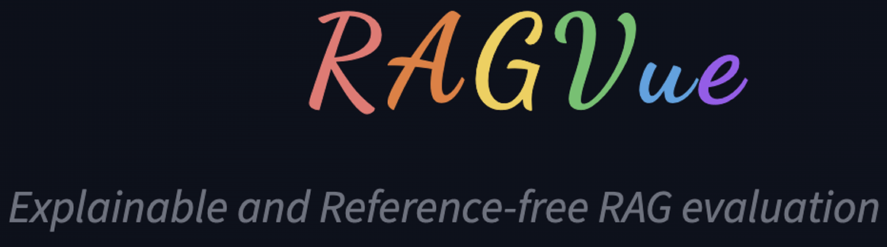

<p align="center">
  
</p>

RAGVue is a **reference-free** evaluation framework for **Retrieval-Augmented Generation (RAG)** systems that goes beyond single scores.  
It provides **interpretable diagnostics** across **retrieval**, **answer quality**, and **factual grounding**, helping you pinpoint *why* a RAG output failed (retrieval vs generation vs grounding).

### ✨ What you get
- 🔍 **Manual Mode** — choose the metrics you want
- 🤖 **Agentic Mode** — automatically selects and runs the right diagnostics
- 🖥️ **Streamlit UI** — no-code, interactive evaluation
- 🔧 **Multiple Interfaces**
  - Python API
  - Python CLI runner (`ragvue-py`)
  - CLI tool (`ragvue-cli`)
  - Streamlit Web UI


<table border="0" cellspacing="0" cellpadding="8" style="border:none;border-collapse:collapse;">
<tr>
<td width="50%" valign="top" style="border:none;">

<b>18 Reference-Free Metrics</b><br><br>
✅ <b>6 core evaluation metrics</b> — retrieval, answer quality, grounding<br>
📉 <b>6 calibration / stability metrics</b> — judge agreement & sensitivity<br>
🧩 <b>6 complex failure-mode metrics</b> — real-world RAG breakdown patterns

Optional: 4 Lightweight Local Metrics ( no API calls) 
</td>

<td width="50%" valign="top" style="border:none;">

<b>Use it to:</b><br><br>
🎯 pinpoint <b>retrieval misses</b> vs <b>hallucinations</b><br>
🔍 compare pipeline changes across iterations (before/after reports)<br>
🚩 flag unstable judge signals via calibration before trusting a metric outcome

</td>
</tr>
</table>


## 🚀 Installation

### Install from source

```
git clone <-repo-url> ragvue
cd ragvue
pip install -e .
```
## 🧠 Usage

RAGVue can be used via:

- **A. Python API**  
- **B. CLI tools (`ragvue-cli` & `ragvue-py`)**  
- **C. Streamlit UI (no-code)**  

### A. Python API

```python
from ragvue import evaluate, load_metrics

items = [
    {"question": "...", "answer": "...", "context": [...]}
]

metrics = load_metrics().keys()
report = evaluate(items, metrics=list(metrics))

print(report)
```

### B. Command-Line Interface (CLI)

#### **1. `ragvue-cli` (main CLI)**

#### Help & List available metrics
```
ragvue-cli --help
ragvue-cli list-metrics
```
####  Manual mode
```
ragvue-cli eval   --inputs <your_data.jsonl>   --metrics <metric_name>   --out-base report_manual   --formats "json,md,csv"
```
#### Agentic mode
```
ragvue-cli agentic   --inputs <your_data.jsonl>   --out-base report_agentic --formats "json,md,csv"
```
#### **2. `ragvue-py` (lightweight Python runner)**

#### Help
```
ragvue-py --help
```

#### Manual mode
```
ragvue-py   --input <your_data.jsonl>   --metrics <metrics>   --out-base report_manual   --skip-agentic
```

#### Agentic mode
```
ragvue-py   --input <your_data.jsonl>  --metrics <metrics> --agentic-out report_agentic   --skip-manual
```
### C. Streamlit UI (No-Code Interface)

Launch the UI:
```
streamlit run streamlit_app.py
```

#### Features
- Upload JSONL files  
- Manual & Agentic metric selection  
- API key input  
- Global summary dashboard  
- Individual case-level diagnostic views  
- Multi-format export (JSON, Markdown, CSV, HTML)  

---

### 📄 Input Format

RAGVue expects JSONL like:

```json
{"question": "...", "answer": "...", "context": ["chunk1", "chunk2"]}
```
### Metrics Overview

**Inputs key:** Q = Question, A = Answer, C = Contexts

#### Core Evaluation Metrics (6)

| **Category**             | **Metric**            | **Inputs**  | **Description**                                                     |
|--------------------------|-----------------------|-------------| ---------------------------------------------------------------------- |
| **Retrieval Metrics**    | *Retrieval Relevance* | Q, C        | Evaluates how useful each retrieved chunk is for addressing the information needs of the question, based on per-chunk relevance scoring.          |
|                          | *Retrieval Coverage*  | Q, C        | Assesses whether the retrieved context collectively provides sufficient coverage for all sub-aspects required to answer the question. |
| **Answer Metrics**       | *Answer Relevance*    | Q, A        | Measures how well the answer aligns with the intent and scope of the question, identifying missing, irrelevant, or off-topic content.        |
|                          | *Answer Completeness* | Q, A        | Determines whether the answer fully addresses all aspects of the question without omissions.      |
|                          | *Clarity*             | A           | Evaluates the linguistic quality of the answer, including grammar, fluency, logical flow, coherence, and overall readability.               |
| **Grounding**            | *Strict Faithfulness* | A, C        | Evaluates how many factual claims in the answer are directly supported by the retrieved context, enforcing strict evidence alignment (entity accuracy and temporal correctness)|

#### Calibration Metrics (6)

| **Metric**                          | **Inputs** | **Description**                                                                              |
|-------------------------------------|------------|----------------------------------------------------------------------------------------------|
| *Calibration: Retrieval Relevance*  | Q, C       | Measures score stability of retrieval relevance across judge configurations.                  |
| *Calibration: Retrieval Coverage*   | Q, C       | Measures score stability of retrieval coverage across judge configurations.                   |
| *Calibration: Answer Relevance*     | Q, A       | Measures score stability of answer relevance across judge configurations.                     |
| *Calibration: Answer Completeness*  | Q, A       | Measures score stability of answer completeness across judge configurations.                  |
| *Calibration: Clarity*              | A          | Measures score stability of clarity across judge configurations.                              |
| *Calibration: Strict Faithfulness*  | A, C       | Measures score stability of strict faithfulness across judge configurations.                  |

#### **[NEW]** Reference-Free Complex Failure Mode Metrics (6)

These metrics detect failure modes that the core metrics miss — no reference answers required.

| **Category**                 | **Metric**                | **Inputs** | **What it catches**                                                                                       | **Returns**                                           |
|------------------------------|---------------------------|------------|-----------------------------------------------------------------------------------------------------------|-------------------------------------------------------|
| **Context Usage**            | *Context Utilization*     | Q, A, C    | Retrieved context is fetched but ignored — the answer doesn't actually use the evidence.                   | `utilized_chunks`, `unused_chunks`, `justification`   |
| **Answer Quality**           | *Answer Conciseness*      | Q, A       | Verbose, repetitive, or filler-heavy answers that obscure the core response.                               | `redundant_parts`, `filler_detected`, `justification` |
|                              | *Coherence*               | Q, A       | Internal self-contradictions, logical fallacies, non-sequiturs, and circular reasoning within the answer.  | `contradictions`, `logical_issues`, `justification`   |
| **Unanswerable Handling**    | *Negative Rejection*      | Q, A, C    | System confidently answers when context doesn't support any answer (should say "I don't know").            | `context_sufficient`, `answer_refuses`, `justification` |
| **Multi-Hop Reasoning**      | *Multi-Hop Faithfulness*  | Q, A, C    | Broken reasoning chains — each step may look fine individually, but the chain is invalid.                  | `reasoning_chain`, `valid_hops`, `broken_hops`, `justification` |
| **Subtle Contradictions**    | *Implicit Contradiction*  | Q, A, C    | Subtle contradictions strict faithfulness misses: omitted qualifiers, shifted scope, negation flips, temporal misattribution. | `contradictions`, `contradiction_types`, `justification` |

#### **[NEW]** Lightweight Local Metrics (4) 

All 4 local metrics run entirely on your machine with zero API calls, zero cost, and near-instant execution. Each metric takes a dictionary with `question`, `answer`, and `contexts` fields and returns a dictionary with a `name`, `score` (0.0 to 1.0), and additional details.
  
   - Token Overlap
   - Answer Length
   - Context Similarity
   - Readability


---

## Metric Selection Guide

### By use case

| Use case                                    | Recommended metrics                                                        |
|---------------------------------------------|----------------------------------------------------------------------------|
| Quick quality check                         | Answer Relevance, Strict Faithfulness, Clarity                             |
| Full evaluation                             | All core metrics                                                           |
| Hallucination audit                         | Strict Faithfulness, Implicit Contradiction, Multi-Hop Faithfulness        |
| Retrieval pipeline debugging                | Retrieval Relevance, Retrieval Coverage, Context Utilization               |
| Production safety check                     | Negative Rejection, Strict Faithfulness, Coherence                         |
| Answer quality tuning                       | Clarity, Answer Conciseness, Coherence, Answer Completeness                |

### By input availability

| What you have         | Metrics you can run                                                                                  |
|-----------------------|------------------------------------------------------------------------------------------------------|
| Q + C only            | Retrieval Relevance, Retrieval Coverage                                                              |
| Q + A only            | Answer Relevance, Answer Completeness, Clarity, Answer Conciseness, Coherence                        |
| Q + A + C             | All metrics                                                                                          |

---
### 🔐 Licensing

RAGVue is released under the **Apache License 2.0**.

For full license text, see: https://www.apache.org/licenses/LICENSE-2.0

###  📩 Contact
For questions, please contact: [ragvue.license@gmail.com](mailto:ragvue.license@gmail.com)

### 📚 Citation

Our demo paper has been accepted to **EACL 2026 (Demo Track)**.

**Title:** *RAGVue: A Diagnostic View for Explainable and Automated Evaluation of Retrieval-Augmented Generation*  
**Status:** Accepted (EACL 2026 Demo Track)  
**Preprint:** https://arxiv.org/abs/2601.04196  

If you use RAGVue in your research, please cite:

```bibtex
@inproceedings{murugaraj2026ragvue,
  title={{RAGVUE}: A Diagnostic View for Explainable and Automated Evaluation of Retrieval-Augmented Generation},
  author={Murugaraj, Keerthana and Lamsiyah, Salima and Theobald, Martin},
  booktitle={Proceedings of the EACL 2026 Demo Track},
  year={2026},
  url={https://openreview.net/forum?id=LBUPAJIX5J}
}


